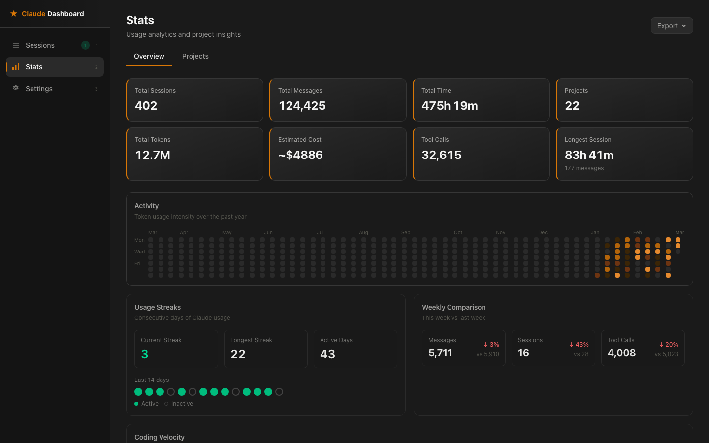
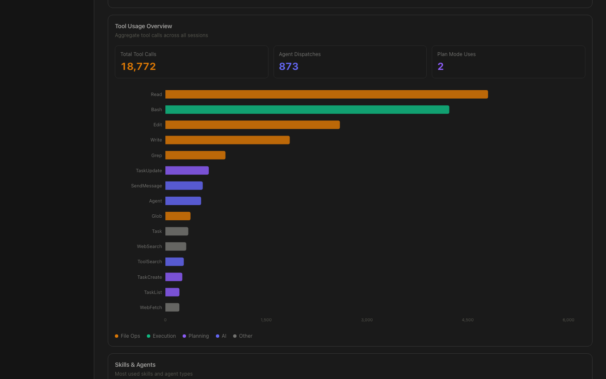
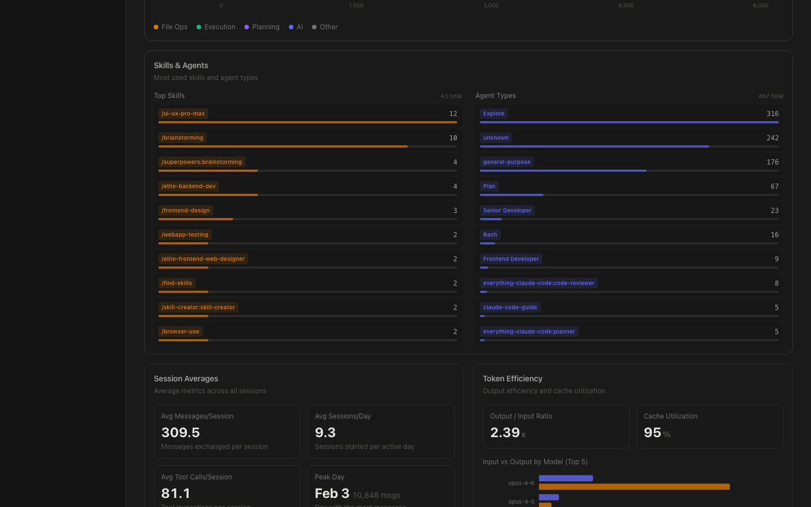
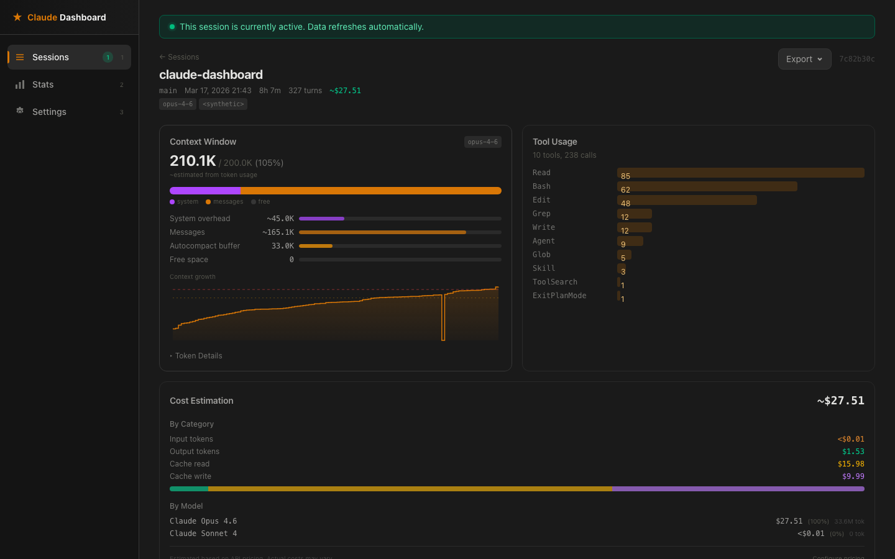

<p align="center">
  
  
  
  
  <a href="https://github.com/VersoXBT/claude-dashboard/actions/workflows/ci.yml"></a>
  <a href="https://codecov.io/gh/VersoXBT/claude-dashboard"></a>
</p>

<h1 align="center">Claude Dashboard</h1>

<p align="center">
  <strong>Local observability dashboard for <a href="https://docs.anthropic.com/en/docs/claude-code">Claude Code</a> sessions</strong><br/>
  Track tokens, costs, models, streaks, and coding velocity -- all offline, all private.
</p>

<p align="center">
  <a href="#quick-start">Quick Start</a> &bull;
  <a href="#features">Features</a> &bull;
  <a href="#screenshots">Screenshots</a> &bull;
  <a href="#how-it-works">How It Works</a> &bull;
  <a href="#contributing">Contributing</a>
</p>

---

```bash
npx @versoxbt/claude-code-dashboard
```



## Why?

Claude Code stores all session data locally in `~/.claude/projects/`, but there is no built-in way to browse, search, or analyze past sessions. As you accumulate hundreds of sessions across dozens of projects, questions start piling up:

- How many tokens did that refactoring session actually use?
- Which tools does Claude call most often in my codebase?
- How much am I spending per project, per day, per model?
- Is the context window filling up mid-session?
- What's my coding velocity trend this week vs last?

This dashboard gives you answers. It reads your local session files, parses the JSONL logs, and presents everything in a fast, searchable web UI that runs entirely on your machine. **Zero data leaves your computer.**

## Features

### Session Explorer
- Full-text search across sessions, projects, branches, and paths
- Filter by status (active / completed), project, and model
- Sortable columns with configurable pagination
- Active session indicator with 3-second real-time polling
- Recent prompts panel from history

### Session Detail View
- Context window utilization breakdown with sparkline growth chart
- Tool usage frequency bar chart (top 15 tools)
- Agent dispatch history with tokens, cost, and tool counts per agent
- Gantt-style timeline chart with zoom controls for tool calls, agent runs, and skills
- Per-session cost estimates with per-model and per-category breakdowns
- Task tracking panel and error log

### Analytics Dashboard (19 metric panels)

| Metric | Description |
|--------|-------------|
| **8 Stat Cards** | Total sessions, messages, tokens, cost, tool calls, time, projects, longest session |
| **Contribution Heatmap** | GitHub-style year-long token intensity visualization |
| **Usage Streaks** | Current streak, longest streak, active days with 14-day dot visualization |
| **Weekly Comparison** | This week vs last week for messages, sessions, tool calls with % change |
| **Coding Velocity** | Messages/day bar chart with 7-day moving average line |
| **Daily Activity** | Stacked bar chart of messages, sessions, and tool calls per day |
| **Tool Usage Overview** | Aggregate tool calls across all sessions, color-coded by category (File Ops, Execution, AI, Planning) |
| **Skills & Agents** | Top skills and agent types with invocation counts and proportional bars |
| **Session Averages** | Avg messages/session, sessions/day, tool calls/session, peak day |
| **Token Efficiency** | Output/input ratio, cache utilization rate, per-model input vs output breakdown |
| **Token Usage Over Time** | Stacked area chart with daily/weekly toggle, top 5 models + "Other" |
| **Model Usage** | Donut chart of token distribution by model |
| **Hourly Distribution** | Session starts by hour of day |
| **Model Breakdown** | Horizontal bar of total tokens per model (input + output) |
| **Model Mix Trends** | 100% stacked area chart showing model proportion shifts over 30 days |
| **Cost Trends** | Stacked cost areas per model with total cost line, daily/weekly toggle |
| **Cache Efficiency** | Cache hit rate percentage, estimated savings in USD |
| **Session Complexity** | Distribution of sessions by daily message volume buckets |

### Per-Project Analytics
- Sortable project table with sessions, messages, cost, and duration
- Drill-down links to filtered session lists
- Summary cards for total projects, sessions, duration, and most active

### Cost Estimation
- Configurable API pricing per model (Opus 4, Sonnet 4, Haiku, etc.)
- Subscription tier support (Free, Pro, Max 5x/20x, Teams, Enterprise)
- Settings persisted to `~/.claude-dashboard/settings.json`

### Privacy & Export
- Privacy mode toggle to anonymize all project names, paths, and branches
- Export data as CSV or JSON (daily activity, token usage, model usage, full stats)
- Safe for screenshot sharing and presentations

## Screenshots

<details>
<summary><strong>Tool Usage Overview</strong></summary>


</details>

<details>
<summary><strong>Skills & Agents</strong></summary>


</details>

<details>
<summary><strong>Session Detail</strong></summary>


</details>


## Quick Start

### Using npx (recommended)

```bash
npx @versoxbt/claude-code-dashboard
```

### Using npm (global install)

```bash
npm install -g @versoxbt/claude-code-dashboard
@versoxbt/claude-code-dashboard
```

### From source

```bash
git clone https://github.com/VersoXBT/claude-dashboard.git
cd claude-dashboard/apps/web
npm install
npm run build
npm start
```

Open [http://localhost:3000](http://localhost:3000) in your browser.

### CLI Options

```
  -p, --port <number>   Port to listen on (default: 3000)
  --host <hostname>     Host to bind to (default: localhost)
  -o, --open            Open browser after starting
  -v, --version         Show version number
  -h, --help            Show this help message
```

> **Note:** The dashboard runs entirely on localhost and only reads files from `~/.claude`. It never modifies any Claude Code data and never sends data over the network.

## How It Works

```
~/.claude/projects/  -->  Scanner  -->  JSONL Parser  -->  Server Functions  -->  React UI
     (local files)       (mtime cache)   (streaming)      (TanStack Start)    (TanStack Query)
```

1. **Scanning** -- Reads `~/.claude/projects/` to discover all session `.jsonl` files. Mtime-based caching avoids re-parsing unchanged files.
2. **Parsing** -- Extracts metadata, tool calls, agent dispatches, token usage, context window data, and errors from JSONL session logs.
3. **Server Functions** -- TanStack Start server functions expose parsed data via type-safe RPC. All file I/O stays on the server.
4. **React Query** -- Fetches data with automatic background refetch. Active sessions use adaptive polling (3s for active badge, 5s for detail pages).
5. **Caching** -- Parsed summaries and heatmap data are cached in memory and on disk (`~/.claude-dashboard/cache/`) for fast startup.

## Tech Stack

| Layer | Technology |
|-------|-----------|
| Framework | [TanStack Start](https://tanstack.com/start) (SSR on Vite) |
| Routing | [TanStack Router](https://tanstack.com/router) (file-based, type-safe) |
| Data | [TanStack Query](https://tanstack.com/query) (caching, polling) |
| Styling | [Tailwind CSS v4](https://tailwindcss.com/) (CSS-first config) |
| Charts | [Recharts](https://recharts.org/) (composable SVG charts) |
| Validation | [Zod](https://zod.dev/) (runtime validation) |
| Runtime | Node.js >= 18 |

## Project Structure

```
apps/web/src/
  routes/                        # File-based routes (TanStack Router)
    _dashboard/
      sessions/
        index.tsx                # Sessions list page
        $sessionId.tsx           # Session detail page
      stats.tsx                  # Stats + per-project analytics (19 panels)
      settings.tsx               # Settings page
  features/                      # Vertical Slice Architecture
    sessions/                    # Session list, filters, search, active badge
    session-detail/              # Detail view, timeline chart, context window
    stats/                       # 19 analytics panels (charts, heatmaps, metrics)
    project-analytics/           # Per-project aggregated metrics
    cost-estimation/             # Cost calculation engine
    settings/                    # Tier selector, pricing editor
    privacy/                     # Privacy mode and anonymization
    theme/                       # Dark/light theme provider
  lib/
    scanner/                     # Filesystem scanner for ~/.claude
    parsers/                     # JSONL session file parsers
    cache/                       # Persistent disk cache
    utils/                       # Formatting, export, path utilities
  components/                    # Shared UI (AppShell, ExportDropdown)
  styles/                        # Tailwind + Claude brand theme
```

## Development

```bash
cd apps/web

npm run dev          # Dev server on localhost:3000
npm run build        # Production build
npm run typecheck    # TypeScript type checking
npm run lint         # ESLint
npm run test         # Unit tests (Vitest)
npm run e2e          # End-to-end tests (Playwright)
```

## Contributing

Contributions welcome! See [CONTRIBUTING.md](CONTRIBUTING.md) for setup instructions and conventions.

Check [good first issues](https://github.com/VersoXBT/claude-dashboard/labels/good%20first%20issue) for beginner-friendly tasks.

If you find this project useful, consider giving it a star -- it helps others discover it.

## Links

- [npm package](https://www.npmjs.com/package/@versoxbt/claude-code-dashboard)
- [Issues](https://github.com/VersoXBT/claude-dashboard/issues)
- [Discussions](https://github.com/VersoXBT/claude-dashboard/discussions)
- [Security Policy](SECURITY.md)

## License

MIT -- see [LICENSE](LICENSE) for details.

---

<p align="center">
  Based on <a href="https://github.com/dlupiak/@versoxbt/claude-code-dashboard">@versoxbt/claude-code-dashboard</a> by dlupiak
</p>
